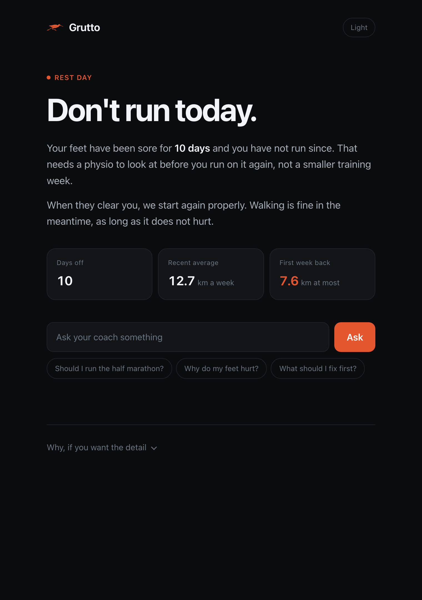
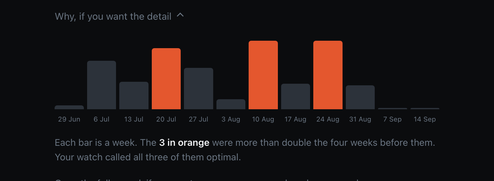

# Grutto

A running coach that is allowed to say no.

Built with the [Strands Agents SDK](https://strandsagents.com) on Amazon Bedrock.

Named after the black-tailed godwit, the Dutch national bird. Its close
relative flies 13,000 km without landing, eating or sleeping. Going a very long
way without breaking down is the whole idea.

## The problem, in one runner's data

This is a real Garmin record. Mine.

On 31 July I ran 15.9 km. My longest run before that was 9.6 km, nine days
earlier. That one run was 100% of my training that week.

Five weeks later I stopped running with pain under both feet and have not
run since.

Here is what my watch said during the three weeks that most overshot what I
had been doing, and on the last day I ran:

    22 Jul   load ratio 1.1   OPTIMAL   MAINTAINING
    13 Aug   load ratio 1.4   OPTIMAL   PRODUCTIVE
    27 Aug   load ratio 1.2   OPTIMAL   PRODUCTIVE
    04 Sep   load ratio 0.9   OPTIMAL   PRODUCTIVE

Garmin does work out an acute to chronic load ratio. It is not a missing
feature, and it is built from heart rate and duration, so a longer run does
register as more load. Two things keep it quiet anyway.

Its chronic window contains the acute week, so a spike sits inside its own
average and gets flattened. And it has no concept of a single run being much
further than anything you have done lately, which is the thing the
running-specific research actually associates with injury.

Here is what mine had been doing:

    07 Jul     1.6 -> 5.0 km    +214%
    08 Jul     5.0 -> 7.5 km     +50%
    22 Jul     7.5 -> 9.6 km     +28%
    31 Jul     9.6 -> 15.9 km    +66%   and it was the whole week

And here is the weekly picture, each week against the four before it:

    06 Jul    18.5 km
    13 Jul    10.5 km
    20 Jul    23.3 km    2.29
    27 Jul    15.9 km
    03 Aug     3.9 km
    10 Aug    29.5 km    2.20
    17 Aug     9.7 km
    24 Aug    32.0 km    2.17
    31 Aug     9.1 km
    07 Sep     0.0 km    stopped, both feet

There is a second thing the watch never surfaced as anything actionable. One of
those 21 runs was in an easy heart rate zone. Garmin has been saying this every
week in its own words, AEROBIC LOW SHORTAGE, on a screen with nothing attached
to it.

To be clear about what is being claimed: these things happened in this order.
That is not proof one caused the other. Grutto says a week or a run was risky.
It never says it caused an injury.

## Why another dashboard would not have helped

Knowing was never the problem. I did less than my watch suggested and still got
hurt. What was missing was something willing to refuse.

Grutto will not write a week you have not earned. When something hurts it
writes no week at all, and says so in the first sentence.

## How it works

Six agents, each with its own memory and a small set of tools.

    coach (runs the order of work, holds no data tools)
    ├── physio          asked first, every time. is anything hurting, and
    │                   should you start that race
    ├── load_analyst    how much you ran, how fast it went up, and how much
    │                   of it was actually easy
    ├── form_analyst    cadence, how you land, whether you hold together
    ├── plan_writer     writes the week. has no data of its own
    ├── safety_officer  approves or refuses, and can refuse
    └── publisher       sends it to the watch

The plan writer proposes. The safety officer can refuse and say why. That
reason goes back and the week gets rewritten. Up to three tries, and if none
pass, the runner is told honestly that no safe week could be written.

**The refusal is enforced in code, not by asking nicely.** The safety officer
returns a typed verdict. A gate fingerprints the exact week that was approved.
The publisher refuses anything that does not match. No wording in any prompt
can push a rejected week onto a watch.

The plan writer deliberately has no data tools. It works only from what the
specialists report, so it cannot go and find a number that suits it. And the
safety officer never sees the plan writer's reasoning, only the proposal and
the numbers, so it cannot be argued into approving something.

Every calculation is plain Python in `tools/`. The models read the numbers and
explain them. They never work them out, because models are poor at arithmetic
and good at judgement.

## What it actually says

Asked for a week by a runner whose feet have been sore for ten days, and who
has since told the physio it is a 2 out of 10, does not hurt when walking, and
is improving:

    plan_writer     -> safety_officer   REJECTED: first week back after 10 days
                                        off should be at most about 8 km
    plan_writer     -> safety_officer   APPROVED
    publisher                           recorded, demo mode

> Three easy runs this week, 7.5 km in total. Tuesday 2 km, Thursday 2.5 km,
> Saturday 3 km, with rest days in between.
>
> Before you lace up on Tuesday, you need a physiotherapist to look at your
> feet. That is not optional.
>
> Every run is easy, heart rate under 145. If your feet react at any point
> during a run, stop and call the physio before the next session. The goal this
> week is three runs that finish feeling exactly the same as they started.

Asked the same thing while the pain is a 6 out of 10, hurts when walking and is
getting worse, it writes no week at all and says so in the first sentence.

Ask it whether to race and it separates the two questions that get conflated:

> Aerobically you are fine. Your fitness is around a 1:40 half marathon, and it
> has been rising. The furthest you have ever run is 15.9 km and the race is
> 21 km, 33% further.

Your engine and your legs are not the same limit, and telling a fit runner they
are unfit is simply wrong.

## Running it

    python -m venv .venv && source .venv/bin/activate
    pip install -r requirements.txt
    cp .env.example .env
    python main.py

Recorded real data by default. No Garmin account needed.

You do need somewhere to run Claude. Either AWS credentials with Bedrock access
in a region that serves Claude, which is the default:

    aws configure          # and enable Anthropic models in the Bedrock console

or an Anthropic key instead, which needs no AWS account at all:

    GRUTTO_MODEL_PROVIDER=anthropic
    ANTHROPIC_API_KEY=sk-ant-...

Without one of those the agents cannot think and you will get a credentials
error on the first question.

    python main.py "Should I race in two weeks?"
    python main.py --as-of 2026-08-24 "Plan my week, I want a big one"
    python main.py --pain "" "Plan my week"          # as if nothing hurt

`--as-of` rewinds. The agents see only what was knowable on that date, which is
how you check what it would have said on the Monday before the injury.

There is also a web interface:

    python serve.py       # http://localhost:5001

### Your own Garmin

Put your login in `.env` and set `GRUTTO_SOURCE=connect`.

### Which Claude

Amazon Bedrock by default. Set `GRUTTO_MODEL_PROVIDER=anthropic` with an
`ANTHROPIC_API_KEY` to use the Anthropic API instead.

## Getting the data honestly

Every Garmin call goes through one interface in `tools/garmin_source.py`:

| Source | How | Good for |
|---|---|---|
| `FixtureSource` | recorded file | the demo, judging, tests |
| `ConnectSource` | unofficial `garminconnect` | your own account only |
| `OfficialSource` | Garmin's Health and Training API | a real product, not built |

The unofficial library signs in as you through Garmin's website. Fine for your
own data, not fine for anyone else's: it breaks Garmin's terms, it stops
working when Garmin changes their site, and it would mean holding other
people's passwords.

The proper route is the Garmin Connect Developer Program, where the runner
approves access on Garmin's own screen and their password never reaches us.
Garmin approves companies only. The interface exists so switching to it is one
new class rather than a rewrite.

`ConnectSource.publish_workout` refuses instead of pretending. Sending a
workout to someone's watch needs Garmin's Training API, and faking that would
be a lie in the one place it matters.

## Where it is weak

Worth saying plainly, because a coach reading this will spot it anyway.

The acute to chronic ratio comes from team sport research measured in session
effort, not running distance. The running-specific evidence for weekly ratios
is weak. Nielsen and colleagues, following several thousand runners, found
weekly volume ratios did not predict injury, while a single run exceeding the
longest run of the previous month did. That is why the single run jump leads
here and the weekly ratio supports it rather than the other way round.

The ratio is still computed, with the chronic window excluding the current
week, because a spike hidden inside its own average is exactly how a watch
misses one. It is one input among several and never the only reason for a
refusal.

Form data exists for 5 of 21 runs and kilometre splits for 1, so the form agent
is deliberately sceptical and will say the sample is too small rather than
call a trend.

One runner's history is one runner's history.

## Architecture

See [docs/ARCHITECTURE.md](docs/ARCHITECTURE.md).

## Licence

MIT.
