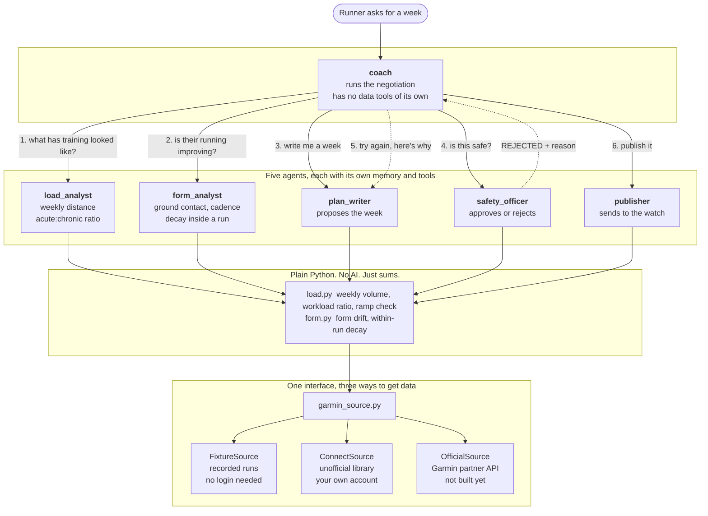

# How Grutto is built

## The part that matters

Step 4 into step 5 is the whole idea. The safety officer can say no, and when it
does, the reason goes back to the plan writer and the week gets rewritten.

That loop is not written in code. The safety officer is told it is allowed to
reject. The coach is told what to do when it does. The two of them work out the
rest between themselves.

## Why five agents instead of one

Each agent has its own memory. The load analyst reads every run and every week,
which is a lot of numbers. The coach never sees any of it, only the two
paragraphs the analyst writes at the end.

With one big agent, all those numbers would pile up in the same memory and crowd
out everything else. Splitting the work keeps each one reading only what it
needs.

## Where the thinking stops and the maths starts

Every number comes from ordinary Python in `tools/`. Weekly distance, the
acute:chronic ratio, form trends, heart rate against pace. The agents read those
numbers and explain them to you. They never work them out themselves, because
models are bad at arithmetic and good at judgement.
