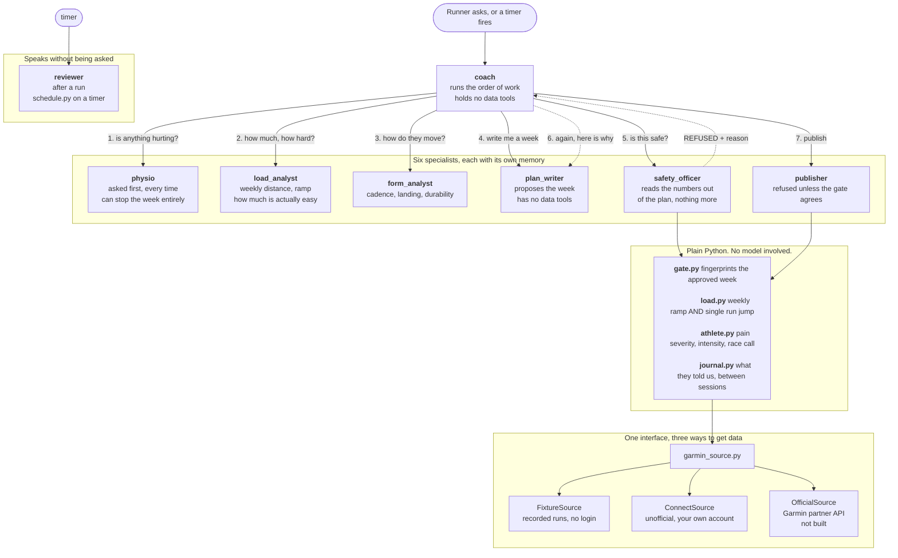

# How Grutto is built

## The refusal is code

The safety officer is not asked for a judgement. A model reads two numbers out
of the proposal, the weekly total and the longest single run, and that is all
it does. Python decides:

- the week against the average of the four weeks before it
- the longest run against the longest of the previous month
- a harder cap on the first week back after time off
- how bad any reported pain is

A gate then fingerprints the exact week that was approved, and the publisher
refuses anything that does not match. No wording in any prompt gets a refused
week onto a watch.

## Why the agents are separate

A planner should not grade its own plan. The safety officer never sees the plan
writer's reasoning, only the proposal and the numbers, so it cannot be talked
round. The plan writer has no data tools at all, so it cannot go and find a
number that suits it.

Each agent also keeps its own memory. The load analyst reads every run and
every week; the coach only ever sees its two-paragraph conclusion.

## Where the thinking stops

Every number comes from plain Python in `tools/`. The models read those numbers
and explain them. They never work them out, because models are poor at
arithmetic and good at judgement.
